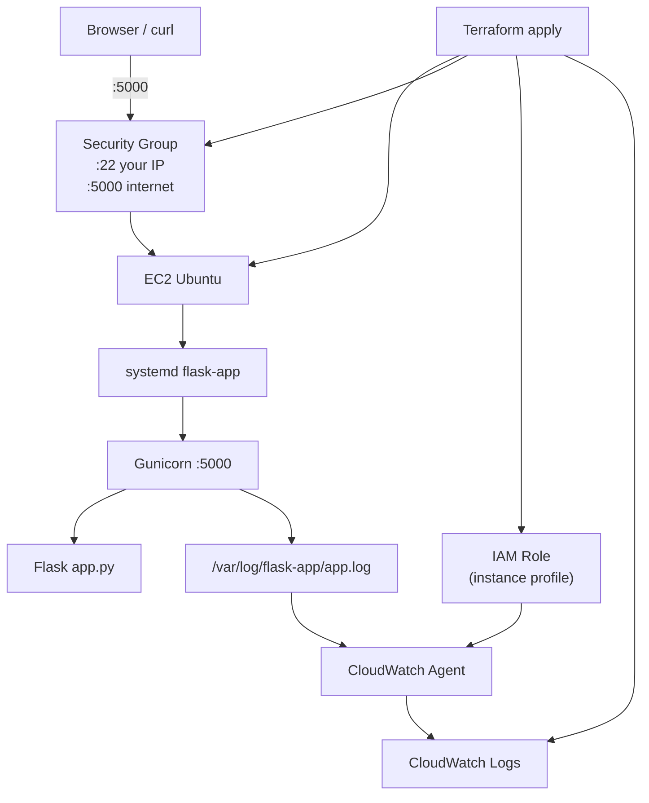
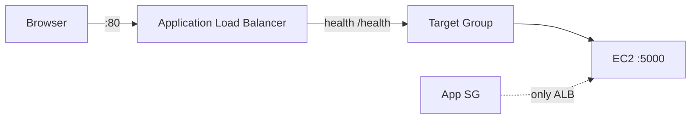
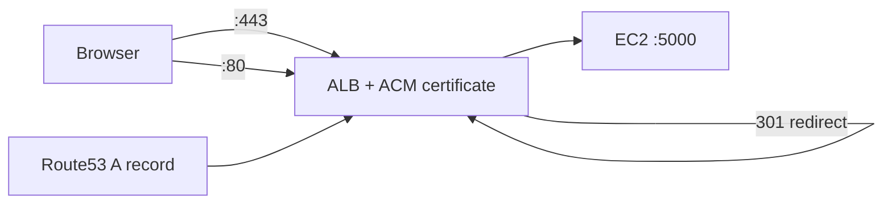

# Cloud Workload Status Service

A production-style Flask API deployed on AWS with Terraform, Gunicorn, systemd, IAM roles, and CloudWatch Logs. Built as a hands-on learning project for cloud engineering and security-focused roles.

## What it does

| Endpoint | Response |
|----------|----------|
| `GET /` | `App is running` |
| `GET /health` | `{"status": "ok"}` |
| `GET /metadata` | hostname, UTC time, app version |

## Architecture

### Default (direct EC2 access)



### With ALB (optional)



### With HTTPS (optional, requires domain + Route53)



## Project structure

```text
project1/
├── app.py                      # Flask application
├── requirements.txt            # Python dependencies
├── .github/workflows/
│   ├── ci.yml                  # Validate Python + Terraform on every PR
│   └── terraform-deploy.yml    # Plan/apply with AWS credentials
└── terraform/
    ├── main.tf                 # EC2, security group
    ├── iam.tf                  # IAM role + instance profile
    ├── cloudwatch.tf           # Log group
    ├── alb.tf                  # Optional load balancer
    ├── https.tf                # Optional ACM + HTTPS listener
    ├── user_data.sh.tpl        # First-boot bootstrap script
    ├── variables.tf
    └── outputs.tf
```

## Prerequisites

- AWS account with CLI configured (`aws configure`)
- EC2 key pair (e.g. `test.pem`) in your target region
- Terraform >= 1.5
- Your public IP for SSH (`https://ifconfig.me` + `/32`)

## Quick start

```powershell
cd terraform
copy terraform.tfvars.example terraform.tfvars
# Edit terraform.tfvars — set ssh_cidr to YOUR_IP/32

terraform init
terraform plan
terraform apply
```

Wait 3–5 minutes for bootstrap, then open the `health_url` from Terraform output.

## Configuration

| Variable | Purpose | Default |
|----------|---------|---------|
| `aws_region` | AWS region | `eu-north-1` |
| `ssh_cidr` | Your IP for SSH | required |
| `key_name` | EC2 key pair name | `test` |
| `enable_alb` | Add load balancer | `false` |
| `enable_https` | ACM + HTTPS on ALB | `false` |
| `domain_name` | FQDN for HTTPS | `""` |
| `route53_zone_name` | Route53 hosted zone | `""` |

## HTTPS (optional)

Requires all of:

1. `enable_alb = true`
2. `enable_https = true`
3. A domain with a **Route53 hosted zone** in AWS
4. `domain_name` and `route53_zone_name` set in `terraform.tfvars`

Terraform will:

- Request an ACM certificate
- Create DNS validation records
- Add HTTPS listener on ALB
- Redirect HTTP → HTTPS

## CI/CD

### CI (automatic on push/PR)

- Python syntax check
- `terraform fmt -check`
- `terraform validate`

No AWS credentials required.

### Deploy workflow (manual)

1. Push repo to GitHub
2. Add repository **Secrets**:
   - `AWS_ACCESS_KEY_ID`
   - `AWS_SECRET_ACCESS_KEY`
   - `TF_VAR_ssh_cidr` (your IP/32)
3. Add repository **Variables** (optional):
   - `AWS_REGION` = `eu-north-1`
   - `TF_VAR_key_name` = `test`
4. Run **Actions → Terraform Deploy → Run workflow** to apply

`terraform apply` only runs on manual `workflow_dispatch` to avoid accidental deploys.

## Troubleshooting

```bash
# On EC2 via SSH
sudo systemctl status flask-app
ss -tlnp | grep 5000
curl localhost:5000/health
sudo journalctl -u flask-app -n 50
```

| Symptom | Likely cause |
|---------|----------------|
| Browser timeout | Security group missing port 5000 |
| `curl` works locally, browser fails | Wrong public IP or SG rule |
| Service not running | `sudo systemctl restart flask-app` |
| No CloudWatch logs | Wait a few minutes; check IAM role on EC2 |

## Learning phases completed

1. Flask on EC2
2. Gunicorn + systemd
3. Linux ops (ps, journalctl, curl)
4. Terraform IaC
5. IAM role + CloudWatch Logs
6. GitHub + CI/CD + optional HTTPS

## Teardown

```powershell
cd terraform
terraform destroy
```

## Remote state (required for CI/CD)

Terraform state is stored in S3 so your PC and GitHub Actions share the same inventory:

| Resource | Name |
|----------|------|
| S3 bucket | `cloud-workload-status-tfstate-240828340986` |
| DynamoDB lock table | `cloud-workload-status-tfstate-lock` |
| State key | `project1/terraform.tfstate` |

**One-time bootstrap** (already done if you followed Phase 6):

```powershell
cd terraform/bootstrap
terraform init
terraform apply
```

**Migrate local state to S3** (one time):

```powershell
cd terraform
terraform init -migrate-state
# type: yes
```

### Error: ResourceAlreadyExists in GitHub Actions

This means CI had **empty state** but AWS already had resources from a local `terraform apply`.

**Fix:** Use the S3 backend above and migrate state. CI and your laptop must share the same state file.

## License

MIT — learning project
